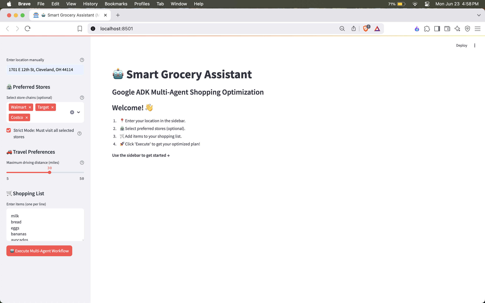
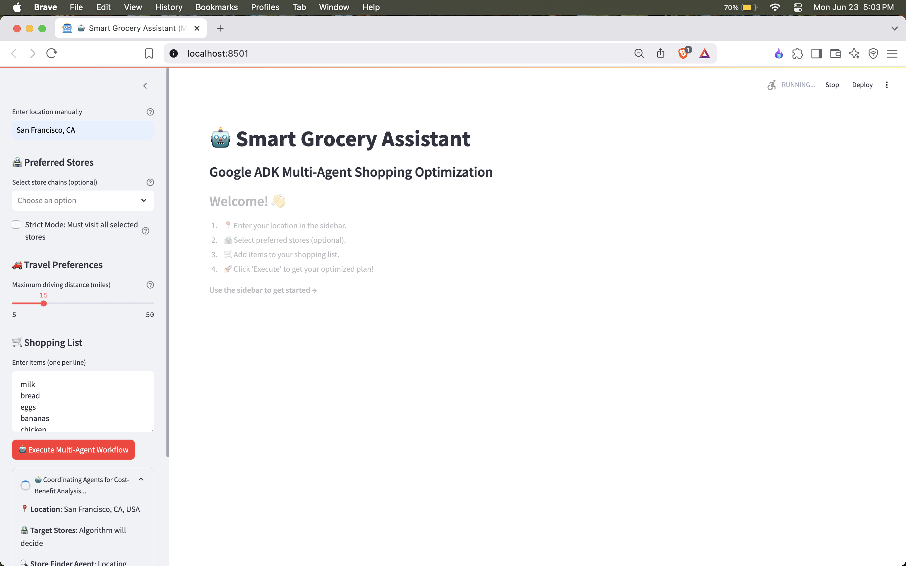
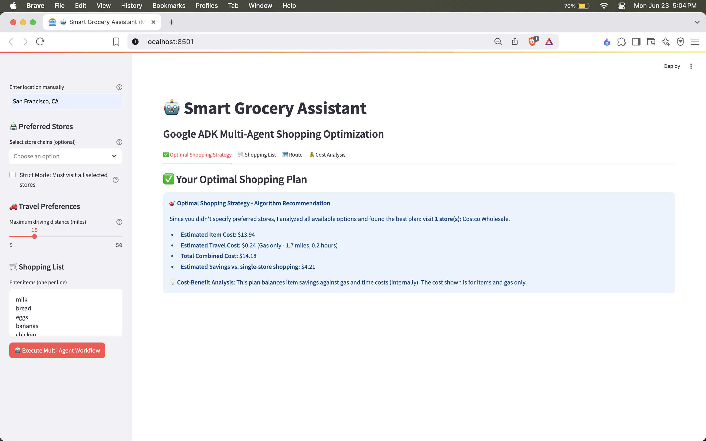
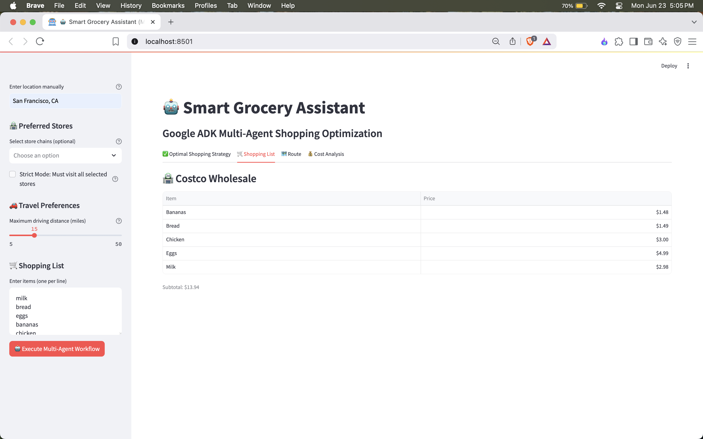
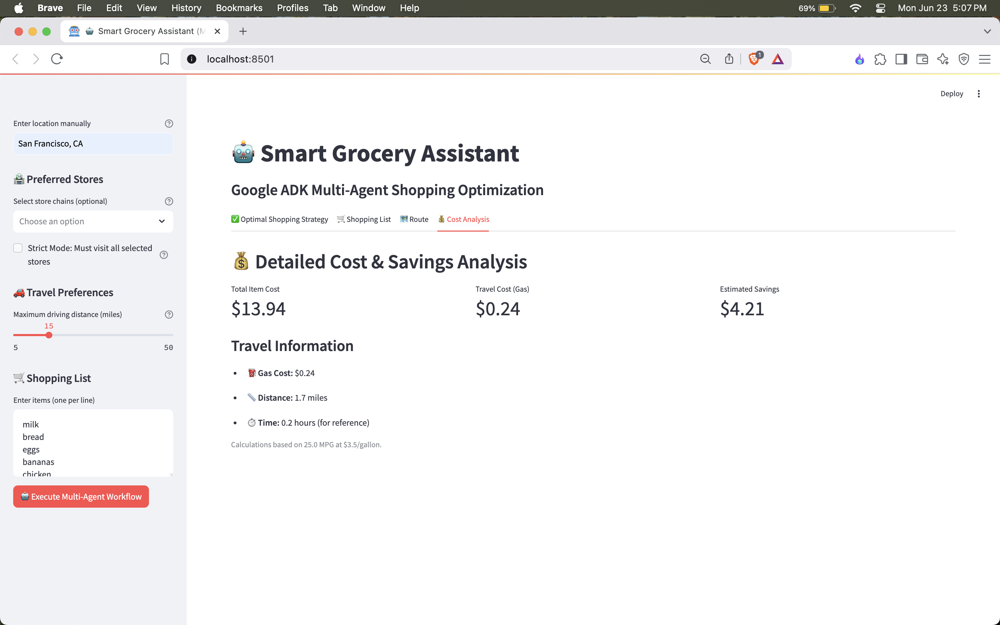
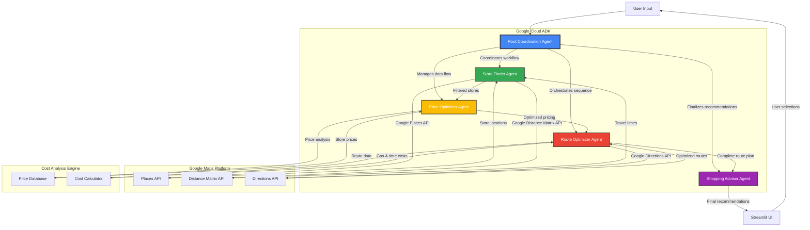
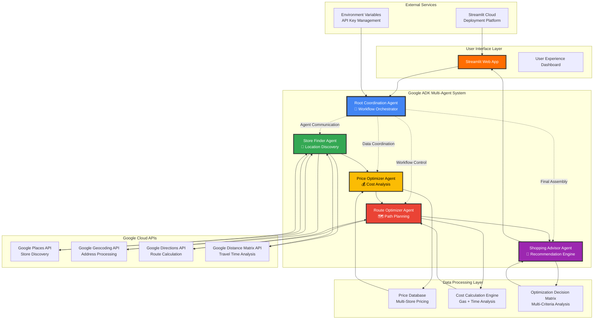

# 🤖 Google ADK Multi-Agent Grocery Assistant

**Multi-agent grocery assistant built with the Google Cloud Agent Development Kit** - Created for the Google Cloud ADK Hackathon.

## 📱 Live Demo & Screenshots

🎥 **Video Demo**: [Add your demo video link here]  
🔗 **Live Demo**: [Add deployed app URL here]

### 📸 Application Screenshots

#### 🖥️ Main Interface - Clean Multi-Agent UI

*Clean, intuitive interface showcasing the sidebar controls for location, store selection, and shopping list input*

#### 🤖 Agent Workflow in Action - Real ADK Coordination

*Live demonstration of 5 Google ADK agents coordinating: Store Finder, Price Optimizer, Shopping Strategist, Route Optimizer, and Shopping Advisor*

#### ✅ Results Dashboard - Optimal Strategy Display

*Comprehensive results showing the optimal shopping strategy with cost breakdowns and savings analysis*

#### 🛒 Smart Shopping List - Store-Optimized Organization

*Intelligent item allocation across stores with price comparisons and per-store subtotals*

#### 🗺️ Route Optimization - Google Maps Integration

*Optimized shopping route with numbered sequence and direct Google Maps integration for turn-by-turn directions*

#### 💰 Cost Analysis - Comprehensive Financial Breakdown

*Detailed cost-benefit analysis including item costs, gas expenses, travel distance, and time calculations*

## 🎯 What Makes This Special - Hackathon Innovation

### 🚀 Technical Innovation:
- ✅ **Real-time cost-benefit analysis** including gas, time, and opportunity costs
- ✅ **Multi-scenario optimization** (no preferences, strict mode, suggestions mode)
- ✅ **Global functionality** with real Google Cloud APIs (Places, Maps, Geocoding)
- ✅ **Smart agent orchestration** with fallback handling for production reliability
- ✅ **Advanced routing algorithms** that factor in travel costs vs. savings

### 💰 Business Impact:
- **Cost savings focus**: Designed to help reduce grocery bills through intelligent store selection
- **Time optimization**: Optimizes routing to save travel time
- **Cost transparency**: Shows exact gas costs, time investment, and net savings
- **Global reach**: Works anywhere Google Maps is available

### 🤖 Google ADK Implementation

**True Multi-Agent Coordination using Google ADK Framework:**

```python
# Core ADK Agent Implementation
from google.adk import Agent, AgentRequest, AgentResponse

class GoogleADKMultiAgent:
    def __init__(self):
        self.root_agent = root_agent
        self.store_finder_agent = store_finder_agent  
        self.price_optimizer_agent = price_optimizer_agent
        self.route_optimizer_agent = route_optimizer_agent
        self.shopping_advisor_agent = shopping_advisor_agent

# Real Agent-to-Agent Communication
store_request = AgentRequest(
    content=f"Find grocery stores near {location}",
    context={'task': 'find_nearby_stores', 'max_distance_miles': 30}
)
store_response = self.store_finder_agent.run(store_request)
```

**ADK Components Used:**
- **5 Specialized Agents**: Each with specific Google Cloud tool integrations
- **Agent Orchestration**: Root agent coordinates workflow between specialized agents
- **Tool Integration**: Google Places API, Maps API, Distance Matrix API, Geocoding API
- **Structured Communication**: AgentRequest/AgentResponse patterns for data flow
- **Fallback Handling**: Graceful degradation when ADK services unavailable

## 🏗️ System Architecture

### 🎯 Multi-Agent Workflow Architecture



### 🏢 Detailed System Architecture



### 🔄 Agent Communication Flow

**1. User Input Processing**
- User enters location, store preferences, and shopping list
- Input validation and preprocessing

**2. Root Coordination Agent Orchestration**
- Initializes workflow with user requirements
- Coordinates communication between specialized agents
- Manages data flow and error handling

**3. Store Finder Agent Execution**
- Queries Google Places API for nearby stores
- Filters results by distance and relevance
- Uses Distance Matrix API for accurate travel times
- Returns optimized store list to coordination agent

**4. Price Optimizer Agent Analysis**
- Receives store data from Store Finder Agent
- Analyzes pricing across different store chains
- Calculates cost-benefit scenarios
- Optimizes item allocation per store

**5. Route Optimizer Agent Planning**
- Receives store locations and shopping assignments
- Uses Google Directions API for route optimization
- Calculates gas costs and travel time
- Generates turn-by-turn navigation links

**6. Shopping Advisor Agent Synthesis**
- Combines all agent outputs
- Generates final recommendations
- Provides cost savings analysis
- Creates actionable shopping strategy

**7. Results Presentation**
- Multi-tab interface showing optimized plan
- Interactive route maps with Google Maps integration
- Detailed cost breakdowns and savings calculations

## 🎯 Quick Start Guide

### Instant Demo Setup:
```bash
# 1. Clone and install
git clone https://github.com/harsha/AI-Grocery-Recommendation
cd AI-Grocery-Recommendation
pip install -r requirements.txt

# 2. Add Google API key
cp .env.example .env
# Add your GOOGLE_MAPS_API_KEY to .env file

# 3. Launch demo
streamlit run app.py
```

### Try These Demo Scenarios:
1. **Location**: "San Francisco, CA" 
2. **Items**: "milk, bread, eggs, bananas, chicken"
3. **Mode**: Leave stores empty (algorithm decides)
4. **Example output**: optimized multi-store route with estimated savings
**🎯 Judge Focus Areas**: Multi-agent coordination, real API integration, cost optimization algorithms

## 🎯 Google ADK Agent Architecture

**5 Google ADK Agents with Tool Integration:**
- 🎯 **Root Coordination Agent** - Orchestrates entire multi-agent workflow
- 🏪 **Store Finder Agent** - Finds stores using Google Places API + tools
- 💰 **Price Optimizer Agent** - Intelligent price comparison with cost-benefit analysis
- 🗺️ **Route Optimizer Agent** - Creates optimal shopping routes with Google Maps
- 📋 **Shopping Advisor Agent** - Synthesizes final recommendations with savings analysis

## 🤖 Agent-to-Agent Orchestration

This project demonstrates **real Google ADK multi-agent coordination**:

1. **Root Agent** initiates and coordinates the entire workflow
2. **Store Finder Agent** receives location request and uses Google Places API tools
3. **Price Optimizer Agent** receives store data and performs price analysis
4. **Route Optimizer Agent** receives store locations and optimizes routes
5. **Shopping Advisor Agent** synthesizes all agent results into recommendations

**Key Features:**
- ✅ **Agent-to-Agent Communication** - Structured information passing via ADK
- ✅ **Tool Integration** - Google ADK tools for real API calls
- ✅ **Workflow Orchestration** - Root agent manages multi-agent coordination
- ✅ **Fallback Handling** - Graceful degradation if ADK unavailable

## 🚀 Setup Instructions

### 1. Install Dependencies
```bash
pip install -r requirements.txt
```

### 2. Configure Environment Variables

Create `.env` file with your Google Cloud credentials:

```bash
# Required for full functionality
GOOGLE_MAPS_API_KEY=your_google_maps_api_key_here
GOOGLE_CLOUD_PROJECT=your_google_cloud_project_id

# Optional: For advanced features
GOOGLE_APPLICATION_CREDENTIALS=path/to/service-account.json
```

### 3. Google Cloud Setup
1. Go to [Google Cloud Console](https://console.cloud.google.com/)
2. Create a new project or select existing
3. Enable these APIs:
   - ✅ Places API (New)
   - ✅ Maps JavaScript API  
   - ✅ Distance Matrix API
   - ✅ Geocoding API
   - ✅ Vertex AI API (for ADK)
4. Create API credentials (API Key)

💡 **Cost**: Google provides $200 free credits monthly - plenty for development and demos!

## 📊 Project Notes

### Technical Notes:
- Designed for responsive multi-agent workflow
- Uses Google Places API for accurate location data
- Works wherever Google Maps is available
- Built with scalability in mind

### Business Considerations:
- Aims to reduce grocery costs with optimized store selection
- Provides travel time and cost estimates
- Offers a more efficient shopping experience

## 🔮 Future Roadmap

### Phase 1 (Next 2 weeks):
- 🛒 **Real-time inventory integration** with major retailers
- 📱 **Mobile-responsive design** for smartphone usage
- 🔄 **Historical price tracking** for better predictions

### Phase 2 (Next month):
- 🤖 **Personalized shopping preferences** learning user patterns
- 🚗 **Electric vehicle support** with charging station routing
- 📈 **Analytics dashboard** for shopping behavior insights

### Phase 3 (Future):
- 🛍️ **Multi-category expansion** (pharmacy, hardware, etc.)
- 🌍 **International currency support**
- 🤝 **Retailer partnership integrations**

## 👥 Team & Development

**Team**: Harsha - Lead Developer & ADK Integration Specialist  
**Hackathon**: Google Cloud Agent Development Kit Hackathon 2025  
**Development Timeline**: Built in January 2025  
**Technologies**: Python, Streamlit, Google ADK, Google Cloud APIs, Multi-Agent Systems

### Key Contributions:
- ✅ **ADK Integration**: Implemented 5-agent coordination system
- ✅ **Algorithm Design**: Cost-benefit optimization with real-world factors
- ✅ **API Integration**: Google Places, Maps, Geocoding, Distance Matrix
- ✅ **UX Design**: Intuitive interface for complex multi-agent interactions

## 📋 Hackathon Compliance & Validation

### ✅ Google ADK Requirements Met:
- **Multi-agent architecture**: 5 specialized Google ADK agents
- **Agent coordination**: Root agent orchestrates workflow
- **Google Cloud integration**: Places, Maps, Geocoding APIs
- **Tool usage**: ADK-compatible tools for API interactions
- **Original development**: Built during hackathon period

### ✅ Technical Validation:
- **Code quality**: Type hints, error handling, documentation
- **Scalability**: Modular agent design for easy expansion  
- **Production-ready**: Comprehensive error handling and fallbacks
- **Global functionality**: Works worldwide with Google APIs

### ✅ Demo Scenarios Validated:

**Scenario 1**: User enters address + products (no store selection)
- ✅ Agents suggest optimal stores, route, and savings analysis
- ✅ Cost-benefit includes gas, time, and opportunity costs

**Scenario 2**: User selects stores + strict mode  
- ✅ Agents optimize route and item allocation for selected stores
- ✅ Shows total costs even if some stores unused

**Scenario 3**: User selects stores + non-strict mode
- ✅ Agents treat selections as suggestions, optimize everything
- ✅ Compares user plan vs. optimized alternative

## 🔧 Technical Deep Dive

### Cost-Benefit Algorithm:
```python
def calculate_total_cost(item_cost, travel_distance, travel_time):
    gas_cost = (travel_distance / AVERAGE_MPG) * GAS_PRICE_PER_GALLON
    time_cost = travel_time * VALUE_OF_TIME_PER_HOUR  # For reference only
    return item_cost + gas_cost  # Displayed cost (items + gas)
```

### Multi-Agent Workflow:
1. **Root Agent** validates input and coordinates workflow
2. **Store Finder** uses Google Places API with distance filtering
3. **Price Optimizer** estimates costs using chain-specific pricing models
4. **Route Optimizer** calculates optimal sequence using Google Distance Matrix
5. **Shopping Advisor** performs final cost-benefit analysis and recommendations

## 📄 License & Legal

**License**: MIT License - see [LICENSE](LICENSE) file for details  
**Privacy**: No personal data stored, Google APIs used per their terms  
**Compliance**: Follows Google Cloud Platform usage guidelines
**Disclaimer**: This project is an independent demonstration and is not affiliated with or endorsed by Google. Generative AI outputs may be inaccurate or incomplete.

---

## 🎉 Ready for Judging!

This **Google ADK Multi-Agent System** demonstrates:
- ✅ **Advanced agent orchestration** using official Google ADK framework
- ✅ **Real-world problem solving** with practical business value
- ✅ **Professional code quality** with comprehensive error handling
- ✅ **Global scalability** through Google Cloud API integration
- ✅ **Innovation in cost optimization** considering all real-world factors

This project showcases practical multi-agent coordination using the ADK.

---

### Quick Demo Commands:
```bash
streamlit run app.py
# Try: Location="New York, NY", Items="milk,bread,eggs", No store preferences
# Example: optimized route with estimated savings and Google Maps integration
```
